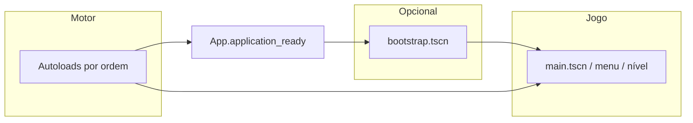

# Core, autoloads e bootstrap

Este documento explica o **núcleo técnico** do projeto Godot 4: o que são estes conceitos, como estão organizados aqui, e como evitar pisar o trabalho dos outros.

## O que é cada conceito

### Autoload (singleton)

Um nó registado em **Project → Project Settings → Autoload** que o motor **cria uma única vez** ao iniciar o jogo e **mantém entre mudanças de cena**. Em GDScript acede-se pelo nome global (ex. `LoopSystem`, `App`).

Serve para:

- estado e regras que atravessam várias cenas (inventário, dia/noite, tempo de nível);
- um **único sítio** para operações globais (ex. mudar de cena com validação).

**Ordem na lista de autoloads** define a ordem dos `_ready()`: quem está **em cima** inicializa primeiro. O **`App`** deve ficar **por último**, para correr depois dos sistemas de jogo (`InventorySystem`, `ChecklistSystem`, `DayNightSystem`, `LoopSystem`).

### Bootstrap (“arranque”)

**Bootstrap** é o primeiro passo **controlado** depois dos autoloads: uma cena mínima (aqui: `scenes/bootstrap.tscn`) que:

1. espera o núcleo da app estar **pronto** (`App.application_ready`);
2. carrega a **primeira cena real** (nível, menu, splash, etc.).

Vantagens:

- separar **“motor ligado”** de **“primeiro ecrã de jogo”**;
- no futuro, carregar configuração, splash ou menu **sem** espalhar `change_scene` por vários sítios;
- a equipa **A** pode apontar `first_scene` para o menu sem mexer em `main.gd`.

**Hoje** o `run/main_scene` continua a ser `main.tscn` por defeito (menos surpresas para quem já trabalha nessa cena). Quando quiserem cadeia menu → jogo, combinam mudar **só** `application/run/main_scene` para `bootstrap.tscn` e ajustar o export `first_scene`.

### Core (`App`)

**Core** aqui não é um módulo gigante — é a fachada **`App`** (`scripts/core/app.gd`):

| Responsabilidade | Fora do `App` (mantido tal como está) |
|------------------|----------------------------------------|
| Sinalizar que autoloads + árvore inicial estabilizaram (`application_ready`) | Níveis, loops, checklists, dia/noite (`LoopSystem`, etc.) |
| API de navegação `go_to_scene` / `go_to_scene_deferred` com validação e sinais | Regras de vitória/falha, puzzles, salas |

Assim **ninguém precisa de duplicar** `ResourceLoader.exists` + `change_scene_to_file` em cada botão ou sala; e **signals** permitem UI Global (fade, som de transição) sem acoplar ao `main`.

## Diagrama do fluxo de vida



- **Caminho atual (padrão):** autoloads → `main.tscn` direto (sem passar pelo bootstrap).
- **Caminho futuro:** autoloads → `bootstrap.tscn` → `menu` ou `main.tscn`.

## Ficheiros envolvidos

| Ficheiro | Função |
|----------|--------|
| `scripts/core/app.gd` | Singleton `App`: arranque + mudança de cena |
| `scripts/bootstrap.gd` + `scenes/bootstrap.tscn` | Entrada opcional; export `first_scene` |
| `project.godot` `[autoload]` | Última entrada: `App` |
| `scripts/main.gd` | Vitória → `App.go_to_scene_deferred(post_victory_scene)` |

## Integração com a equipa

- **A (menu):** pode usar só `App.go_to_scene("res://scenes/main.tscn")` nos botões; quando existir menu, considerar `run/main_scene` = `bootstrap.tscn` e `first_scene` = menu.
- **B (salas):** continua a instanciar em `main.tscn` (ou fluxo acordado). Não é obrigatório chamar `App` nas salas.
- **D (conteúdo):** sem dependência do `App`.

**Commits:** alterações apenas a `[autoload]` ou `run/main_scene` convém isolá-las em commits pequenos e combinar no grupo se várias pessoas mexerem no `project.godot` no mesmo dia.

## API rápida do `App`

```gdscript
# Esperar arranque completo (ex. em bootstrap ou ferramentas)
await App.application_ready

# Mudança segura a partir de sinais / UI
App.go_to_scene_deferred("res://scenes/menu.tscn")

# Mudança imediata (só quando já estás num frame “seguro”)
var err: Error = App.go_to_scene("res://scenes/main.tscn")
```

Sinais úteis: `scene_change_started(path)`, `scene_change_finished` — para fade ou áudio de transição.

---

*Alinhado com `docs/INTEGRATION.md` e com os sistemas existentes em `scripts/systems/`.*
