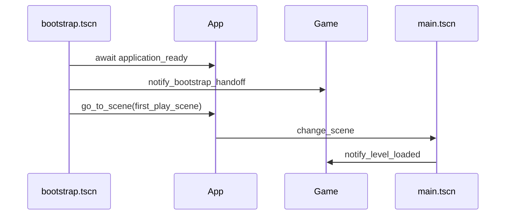

# Core, autoloads e bootstrap

Arquitetura de arranque e estado global para **Sins Of The Vamps** (Godot 4).

## Camadas (o que é “core” aqui)

| Camada | Singleton | Função |
|--------|-----------|--------|
| **Motor / cena** | `App` | Sinal `application_ready`; `go_to_scene` / `go_to_scene_deferred` com validação e sinais de transição. |
| **Jogo / run** | `Game` | Fases da corrida (`RunPhase`), path pós-bootstrap (`first_play_scene`), vitória com ou sem mudança de cena, falha antes do reload. |
| **Sistemas** | `LoopSystem`, etc. | Regras de nível (tempo, checklist, dia/noite, inventário) — **inalterados** por esta arquitetura. |

**Ordem dos Autoloads** (de cima para baixo no Project Settings):  
`InventorySystem` → `ChecklistSystem` → `DayNightSystem` → `LoopSystem` → **`App`** → **`Game`**.

Quem está **em baixo** corre `_ready()` **depois** dos de cima. `Game` vem por último para poder ligar-se ao `App` e ao `LoopSystem` já instanciados.

## Fluxo real (como está o projeto)

1. **`run/main_scene`** = `res://scenes/bootstrap.tscn`.
2. Autoloads inicializam; `App` agenda o fim do boot; cena atual = **Bootstrap**.
3. `bootstrap.gd`: `await App.application_ready` → `Game.notify_bootstrap_handoff()` → `App.go_to_scene(Game.first_play_scene)` (por defeito **`intro_vampire_bite.tscn`**, que no fim abre **`main.tscn`**).
4. **`main.gd`**: `LoopSystem.start_level_session()` + `Game.notify_level_loaded()` → fase **`IN_LEVEL`**.
5. **Falha de tempo**: `LoopSystem` emite `level_failed` → `Game` passa a **`LEVEL_FAILED_PENDING_RELOAD`** → reload da cena → `main` corre outra vez → **`IN_LEVEL`**.
6. **Vitória**: `main` chama `Game.go_to_post_victory(post_victory_scene)` → **`LEVEL_WON`** (sem path) ou **`TRANSITIONING`** + mudança de cena.



## UIDs e autoloads

Se o editor mostrar **`Unrecognized UID`** para `Game` ou `App`, o `project.godot` deve referenciar os scripts por **`res://scripts/core/...`** (como no repo atual), não por UID inventado à mão — o Godot só reconhece UIDs que ele próprio regista.

## Ficheiros

| Ficheiro | Papel |
|----------|--------|
| `scripts/core/app.gd` | Arranque estável + navegação entre `.tscn`. |
| `scripts/core/game.gd` | Estado `RunPhase` + `first_play_scene` + `go_to_post_victory`. |
| `scripts/bootstrap.gd` + `scenes/bootstrap.tscn` | Entrada do exe/projecto. |
| `scripts/main.gd` | Sessão de nível + chamadas a `Game`. |
| `project.godot` | `run/main_scene` + lista de autoloads. |

---

## Como ver **tudo** a funcionar (passo a passo)

### 1. Correr o jogo normal (F5)

- O projeto **entra** em `bootstrap` (podes não notar — é instantâneo) e **acaba** em `main.tscn`.
- O jogo deve comportar-se **como antes** a nível de jogabilidade.

### 2. Ver o **bootstrap** e o **App** na consola

1. Abre **Editor → Editor Settings** (opcional) ou usa **Output** em baixo.
2. Em `scripts/core/app.gd`, dentro de `_complete_boot()`, podes acrescentar **temporariamente**:  
   `print("[App] application_ready")`
3. Em `scripts/bootstrap.gd`, antes de `App.go_to_scene`:  
   `print("[Bootstrap] → ", path)`
4. **F5** — na **Output** deves ver primeiro as mensagens do `App` (após dois frames), depois o `Bootstrap` com o path para `main.tscn`.

Remove os `print` quando não precisares (evita poluir a build).

### 3. Ver as **fases** do `Game` (`RunPhase`)

1. **Project → Project Settings → Autoload**.
2. Seleciona **`Game`** na lista (em Godot 4 podes precisar de editar o recurso ou abrir o script e usar valores por defeito).
3. Ativa **`debug_log_phases`** no inspector do script **se** o editor mostrar as propriedades exportadas do autoload; se não aparecerem, abre `scripts/core/game.gd` e põe **temporariamente** `debug_log_phases: bool = true` no `@export`.
4. **F5** — na **Output** esperas uma sequência do tipo:
   - `APPLICATION_READY`
   - `ENTERING_FIRST_SCENE`
   - `IN_LEVEL`  
   Após **falha** de nível: `LEVEL_FAILED_PENDING_RELOAD`, depois outra vez `IN_LEVEL`.  
   Após **vitória** sem `post_victory_scene`: `LEVEL_WON`.

### 4. Ver **transição** pós-vitória

1. Abre `scenes/main.tscn` → nó **Main** → preenche **Post Victory Scene** com um `.tscn` de teste (podes duplicar `main` ou criar uma cena vazia).
2. Joga até completar o nível e sair pela porta.
3. Esperado: `Game` passa a **`TRANSITIONING`** e a cena muda (e logs de `App` se adicionares prints aos sinais `scene_change_*`).

### 5. Menu (equipa **A**) — ponto de extensão

- Deixa **`run/main_scene`** = `bootstrap.tscn`.
- Altera **`Game.first_play_scene`** para `res://scenes/menu.tscn` (quando existir).
- No menu, botão “Jogar”: `App.go_to_scene("res://scenes/main.tscn")` (ou path acordado).

## API rápida

```gdscript
await App.application_ready
App.go_to_scene_deferred("res://scenes/main.tscn")
Game.go_to_post_victory("res://scenes/menu.tscn")
Game.run_phase  # leitura do estado atual
Game.run_phase_changed.connect(func(p): pass)
```

---

*Ver também [INTEGRATION.md](INTEGRATION.md) para papéis A/B/D.*
